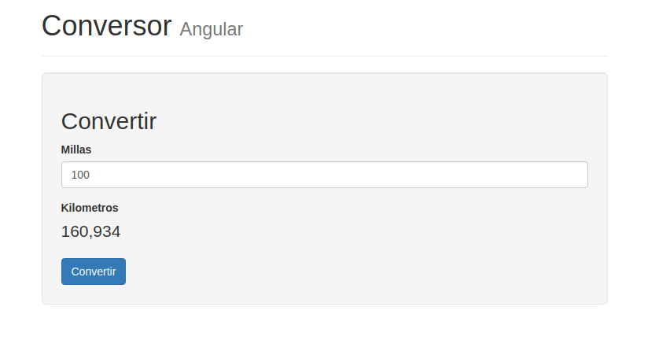

# Conversor en Angular

[](https://github.com/uqbar-project/eg-conversor-angular/actions/workflows/build.yml) 

Este proyecto representa el clásico ejemplo del conversor de millas a kilómetros, generado con [Angular CLI](https://github.com/angular/angular-cli) versión 10.0.4, y modificado luego manualmente.

## Cómo probarlo

Desde el raíz del proyecto, en una consola, ejecutar:

```bash
npm start
```

Y en el navegador cargar la página `http://localhost:4200/`

## Generación inicial del proyecto

Seguimos los pasos que están en [la página de inicio de Angular](https://angular.io/guide/quickstart)

## Estructura de una aplicación en Angular

Toda aplicación tiene

- módulos, que agrupan funcionalidades
- componentes, que encapsulan una asociación vista (HTML)-modelo (en este caso en TypeScript) y que por defecto vienen acompañados de tests (*.spec, en TypeScript). Opcionalmente también tenemos un archivo de estilos asociado (css)

```bash
(nodo raíz)
 + src
   + app
     - app.component.css       -- estilos para el componente app
     - app.component.html      -- vista
     - app.component.spec.ts   -- test
     - app.component.ts        -- componente que relaciona vista y su modelo (un objeto de dominio)
     - app.module.ts           -- módulo
   + domain
     - conversor.ts            -- objeto de dominio
```

Como es nuestro primer ejemplo, vamos a modificar el comportamiento de AppModule y AppComponent, que es el elemento inicial de nuestra aplicación en Angular. A futuro vamos a crear nuevos componentes y módulos.

# Conceptos principales

## Binding entre vista y modelo


El conversor tiene un formulario html que permite ingresar valores. El _binding_ permite relacionar un elemento visual con su correspondiente modelo de vista. En este caso el modelo de la vista es tan sencillo que coincide con un objeto de negocio: un Conversor de millas a kilómetros.

El _binding_ puede ser:

- bidireccional, como en el caso de las **millas**, ya que un cambio en la vista puede provocar un cambio en su modelo, o bien un cambio en el modelo puede implicar que se dispare una actualización en la vista. 
- unidireccional, como en el caso de los **kilómetros**, ya que en el formulario HTML solo se visualiza la información (el usuario no ingresa la información en este caso, así que solo el modelo actualiza la vista)

Dado que el binding bidireccional tiene un costo (a medida que incorporamos más controles el sistema de notificaciones crece en complejidad), es importante diferenciar ambos tipos de binding:

```html
<input name="millas" [(ngModel)]="conversor.millas">  <!-- bidireccional-->
```

vs.

```html
<p>{{conversor.kilometros}}</p>   <!-- unidireccional -->
```

El binding de millas es "conversor.millas" lo que implica que en el modelo debe existir una referencia conversor (con una propiedad millas). Eso es lo que hacemos en la definición de nuestro componente:

```typescript
export class AppComponent {
  title = 'Conversor'
  conversor = new Conversor()
}
```

La implementación del objeto de dominio Conversor no es nada sorprendente:

```typescript
export class Conversor {
 
    millas = 0
    kilometros = 0

    convertir() {
        this.kilometros = this.millas * 1.60934
    }
}
```

## Validaciones

Queremos validar

- que no sea posible convertir un valor de milla nulo
- que el usuario no pueda ingresar valores alfabéticos para la milla

En caso de que alguno de esas condiciones ocurra, queremos mostrar un cartel de error representativo.

Para lograr esto, tenemos que poder referenciar a un control de nuestro form html. El formulario tiene ya un nombre -esto lo hizo Angular cuando le pedimos que creara una aplicación-:

```html
<form name="convertirForm" role="form">
```

Además hay que incorporar una anotación para el control de millas:

```html
<input name="millas" required 
    [(ngModel)]="conversor.millas" 
    #millas="ngModel"
```

Le decimos que el input millas es requerido (_required_) y además definimos una _template variable_ millas, que ahora podemos usar dentro del formulario html para preguntar si el input es válido o tiene errores específicos:

```html
<div *ngIf="millas.invalid && (millas.dirty || millas.touched)">
    <br>
    <div>
    Error:
        <span *ngIf="millas.errors.required">¡Debe ingresar millas!</span>
        <span *ngIf="millas.errors?.pattern">Formato debe ser numérico</span>
    </div>
</div>
```

Además de utilizar esta secuencia de caracteres:

- `[()]` (_banana in a box_) para indicar binding bidireccional 
- y `{{}}` (_moustache_) para indicar binding unidireccional 

Tenemos el asterisco `*ngIf` que es una **directiva** propia de Angular para intercalar funcionalidades al html que es estático. Podemos acceder a la _template variable_ millas que anteriormente definimos, y consultar algunas propiedades:

- invalid: dice si el valor definido en dicho campo es correcto (también existe _valid_)
- dirty: si el usuario modificó el valor (el opuesto es _pristine_)
- touched: si el usuario pasó por ese control y saltó a otro (el opuesto es _untouched_) 

Para más información recomendamos leer [la página de validación de formularios de Angular](https://angular.io/guide/forms).

Entonces el ngIf mostrará el contenedor div de html si la condición encerrada entre las comillas se cumple.

## Pipes

Los [_pipes_](https://angular.io/guide/pipes) permiten hacer transformaciones de nuestros objetos con el fin de cambiar su visualización. Por ejemplo un formato con n decimales con coma, en lugar del punto que por defecto muestra Angular. 

Primero vamos a agregar el paquete [angular localize](https://angular.io/guide/i18n#add-the-localize-package): 

```bash
npm i @angular/localize
```

Luego hay que importar la configuración regional española (también llamado _locale_ es) en el app.module.ts:

```typescript
import '@angular/common/locales/global/es'
``` 

Y ahora sí podemos utilizarlo en la vista, dentro del binding unidireccional para kilómetros:

```html
<p *ngIf="!millas.errors">{{conversor.kilometros | number:'1.3-3':'es' }}</p>
```

Este concepto permite dar formato al valor que se encuentra a la izquierda del pipe, en nuestro caso

- el valor es conversor.kilometros
- le aplicamos formato de número
- con un dígito entero como mínimo
- y con 3 dígitos decimales mínimos y máximos

De esa manera el 0 se muestra como "0,000", y la conversión de 100 queda como se ve en la pantalla

 

Para más información sobre los pipes que trae Angular pueden ver [esta página](https://angular.io/api?type=pipe)

## Testing

Angular trae un conjunto de tests al crear un proyecto, en este caso en el archivo `app.component.spec.ts`

Podemos ejecutar la prueba automatizada desde una terminal (de línea de comandos o bien la integrada de nuestro IDE):

```bash
> npm test
```

la configuración de los tests levanta un browser de Chrome, se ejecutan y luego quedan esperando a modificaciones

### Dependencias

Un tema importante a la hora de correr los tests es que lo hacen en forma independiente de la aplicación Angular, por lo tanto debemos inyectar las dependencias que están en el @NgModule (recordemos que en este ejemplo es el archivo _app.module.ts_).

Para esto importamos la constante `importsConversor` que contiene los módulos BrowserModule y FormsModule.

```typescript
import { importsConversor } from './app.module'
```
- FormsModule lo necesitamos para poder levantar un mock de la pantalla

Además tenemos otros imports que se crean por defecto cuando generamos nuestra aplicación con el comando ng: nuestro componente AppComponent y un _mockeador_ de nuestro componente llamado TestBed que más adelante explicaremos, entre otros.

### Primeras pruebas

Veamos el primer test

```typescript
describe('Tests de AppComponent', () => {
  let appComponent: ComponentFixture<AppComponent>
  let componente: { conversor: { millas: number } }

  beforeEach(async () => {
    await TestBed.configureTestingModule({
      declarations: [AppComponent],
      imports: importsConversor
    }).compileComponents()
    appComponent = TestBed.createComponent(AppComponent)
    componente = appComponent.debugElement.componentInstance
    appComponent.detectChanges()
  })

  it('debe crear correctamente la aplicación', waitForAsync(() => {
    expect(componente).toBeTruthy()
  }))
```

En el método beforeEach inicializamos dos variables muy importantes para poder hacer pruebas

- appComponent: un NgModule _mockeado_ por el componente de testing de Angular llamado TestBed
- componente: una referencia a nuestro componente de Angular, también mockeado

El primer test valida que el componente sea un valor posible ([truthy](https://developer.mozilla.org/es/docs/Glossary/Truthy), este test tiene sentido como **smoke test** de que cualquier cambio que introduzcamos no rompa el componente. Es un test básico de que la aplicación levanta.

## Tests que aplican sobre elementos del DOM inicial

Si queremos testear la conversión ¿cómo simulamos la carga de un valor? Tenemos que encontrar el input dentro de la página, las opciones son 

- por el tag `<input>`: tiene la desventaja de que el tag HTML tiene un sentido semántico y es visible por el usuario, está sujeto a cambios. Podemos cambiar un span por un div, o un button por un anchor (a href) y eso revela la fragilidad de nuestros tests.
- por un id: si bien soporta mejor el cambio estético, sigue siendo algo que el navegador renderiza en la página.
- por un atributo que tiene el tag, en este caso `data-testid`, será la opción que recomendemos nosotros, basado en [esta página](https://kentcdodds.com/blog/making-your-ui-tests-resilient-to-change). El prefijo `data-` hace que los navegadores lo ignoren en el render, pero los tests lo pueden utilizar. De esa manera no interfieren los atributos propios para mostrar la página vs. los atributos para testearla. Bueno, hay cierta intrusión porque si no tuviéramos tests tendríamos menos tags que leer, pero es un costo lo suficientemente justo.

Nuestro html queda:

```html
<input data-testid="millas" name="millas" ...
```

Y en los tests tendremos una función de alto nivel para buscar un elemento por `data-testid`:

```ts
const buscarElemento = (testId: string) => {
  const compiled = appComponent.debugElement.nativeElement
  return compiled.querySelector(`[data-testid="${testId}"]`)
}
```

El _nativeElement_ es una simplificación del DOM que parsea el browser, y dentro de esa jerarquía de elementos visuales que tiene el DOM podemos hacer la consulta [querySelector](https://www.w3schools.com/jsref/met_document_queryselector.asp), por

- un tag específico (en este caso, 'h1')
- por un identificador (anteponiendo un numeral)
- por cualquier elemento que tenga una clase determinada (utilizando como prefijo un punto: '.')
- o bien por cualquier otro atributo, como será nuestro caso

Un detalle importante es que la función está definida dentro del contexto de los tests, por eso la referencia appComponent existe. Si la definiéramos afuera tendríamos que recibir `appComponent` como parámetro de la función.

## Tests de interacción con el usuario

Por último, ¿qué sucede si ingresamos el valor 100? Nuestro valor esperado es 160,934. Para ello podemos

- modificar el componente de Angular (recordemos que AppComponent tiene como propiedades title y conversor que apunta a un objeto de dominio Conversor)
- o bien simular la interacción de carga de un usuario (donde ingresa el valor "100" como string en el elemento input millas, y luego dispara el botón Convertir)

El resultado se captura del DOM como vimos anteriormente. Mostramos uno de los tests:

```ts
  it('conversión de millas a kilómetros exitosa con 3 decimales', () => {
    const millasInput = buscarElemento('millas')
    millasInput.value = 100
    millasInput.dispatchEvent(new Event('input'))

    const convertirButton = buscarElemento('convertir')
    convertirButton.click()

    appComponent.detectChanges()
    const resultado = buscarElemento('kilometros')
    expect(resultado.textContent).toContain('160,934')
  })
```

En la solución encontrarás algunas abstracciones adicionales, aquí por motivos didácticos queremos concentrarnos en el flujo de interacciones:

- cargamos un valor en el componente
- luego simulamos que la persona usuaria presiona el botón "Convertir"

Para más información recomendamos leer [la documentación oficial de Angular](https://angular.io/guide/testing)
