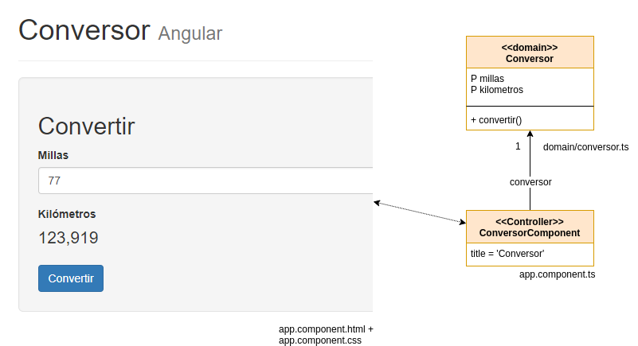
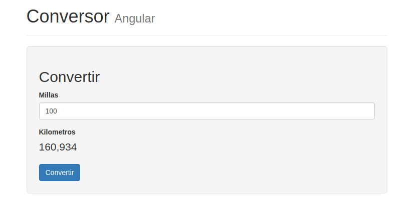

# Solución con Binding y Template

En el navegador cargar la página `http://localhost:4200/`

## Generación inicial del proyecto

Seguimos los pasos que están en [la página de inicio de Angular](https://angular.io/guide/quickstart)

## Estructura de una aplicación en Angular

Toda aplicación tiene

- módulos, que agrupan funcionalidades
- componentes, que encapsulan una asociación vista (HTML)-modelo (en este caso en TypeScript) y que por defecto vienen acompañados de tests (*.spec, en TypeScript). Opcionalmente también tenemos un archivo de estilos asociado (css)

```bash
(nodo raíz)
 + src
   + app
     - app.component.css       -- estilos para el componente app
     - app.component.html      -- vista
     - app.component.spec.ts   -- test
     - app.component.ts        -- componente que relaciona vista y su modelo (un objeto de dominio)
     - app.module.ts           -- módulo
   + domain
     - conversor.ts            -- objeto de dominio
```

Como es nuestro primer ejemplo, vamos a modificar el comportamiento de AppModule y AppComponent, que es el elemento inicial de nuestra aplicación en Angular. A futuro vamos a crear nuevos componentes y módulos.

# Conceptos principales

## Binding entre vista y modelo



El conversor tiene un formulario html que permite ingresar valores. El _binding_ permite relacionar un elemento visual con su correspondiente modelo de vista. En este caso el modelo de la vista es tan sencillo que coincide con un objeto de negocio: un Conversor de millas a kilómetros.

El _binding_ puede ser:

- bidireccional, como en el caso de las **millas**, ya que un cambio en la vista puede provocar un cambio en su modelo, o bien un cambio en el modelo puede implicar que se dispare una actualización en la vista. 
- unidireccional, como en el caso de los **kilómetros**, ya que en el formulario HTML solo se visualiza la información (el usuario no ingresa la información en este caso, así que solo el modelo actualiza la vista)

Dado que el binding bidireccional tiene un costo (a medida que incorporamos más controles el sistema de notificaciones crece en complejidad), es importante diferenciar ambos tipos de binding:

```html
<input name="millas" [(ngModel)]="conversor.millas">  <!-- bidireccional-->
```

vs.

```html
<p>{{conversor.kilometros}}</p>   <!-- unidireccional -->
```

El binding de millas es "conversor.millas" lo que implica que en el modelo debe existir una referencia conversor (con una propiedad millas). Eso es lo que hacemos en la definición de nuestro componente:

```typescript
export class AppComponent {
  title = 'Conversor'
  conversor = new Conversor()
}
```

La implementación del objeto de dominio Conversor no es nada sorprendente:

```typescript
export class Conversor {
 
    millas = 0
    kilometros = 0

    convertir() {
        this.kilometros = this.millas * 1.60934
    }
}
```

## Validaciones

Queremos validar

- que no sea posible convertir un valor de milla nulo
- que el usuario no pueda ingresar valores alfabéticos para la milla

En caso de que alguno de esas condiciones ocurra, queremos mostrar un cartel de error representativo.

Para lograr esto, tenemos que poder referenciar a un control de nuestro form html. El formulario tiene ya un nombre -esto lo hizo Angular cuando le pedimos que creara una aplicación-:

```html
<form name="convertirForm" role="form">
```

Además hay que incorporar una anotación para el control de millas:

```html
<input name="millas" required 
    [(ngModel)]="conversor.millas" 
    #millas="ngModel"
```

Le decimos que el input millas es requerido (_required_) y además definimos una _template variable_ millas, que ahora podemos usar dentro del formulario html para preguntar si el input es válido o tiene errores específicos:

```html
@if (millas.invalid && (millas.dirty || millas.touched)) {
    <div class="form__error" data-testid="errors">
        Error:
        @if (millas.errors?.['required']) {
            <span>¡Debe ingresar millas!</span>
        }
        @if (millas.errors?.['pattern']) {
            <span data-testid="numeric-format">Formato debe ser numérico</span>
        }
    </div>
}
```

Además de utilizar esta secuencia de caracteres:

- `[()]` (_banana in a box_) para indicar binding bidireccional 
- y `{{}}` (_moustache_) para indicar binding unidireccional 

Tenemos el bloque `@if` que es una solución que ofrece Angular para intercalar condicionalmente funcionalidades al html que es estático. Podemos acceder a la _template variable_ millas que anteriormente definimos, y consultar algunas propiedades:

- invalid: dice si el valor definido en dicho campo es correcto (también existe _valid_)
- dirty: si el usuario modificó el valor (el opuesto es _pristine_)
- touched: si el usuario pasó por ese control y saltó a otro (el opuesto es _untouched_) 

Para más información recomendamos leer [la página sobre validación de formularios de Angular](https://angular.dev/guide/forms/template-driven-forms).

Entonces el bloque @if mostrará el contenedor div de html si la condición encerrada entre las comillas se cumple.

## Pipes

Los [_pipes_](https://angular.io/guide/pipes) permiten hacer transformaciones de nuestros objetos con el fin de cambiar su visualización. Por ejemplo un formato con n decimales con coma, en lugar del punto que por defecto muestra Angular. 

Primero vamos a agregar el paquete [angular localize](https://angular.io/guide/i18n#add-the-localize-package): 

```bash
npm i @angular/localize
```

Luego hay que importar la configuración regional española (también llamado _locale_ es) en el app.module.ts:

```typescript
import '@angular/common/locales/global/es'
``` 

Y ahora sí podemos utilizarlo en la vista, dentro del binding unidireccional para kilómetros:

```html
@if (!millas.errors) {
    <p class="form__control" id="kilometros" data-testid="kilometros">
        {{kilometros() | number:'1.3-3':'es' }}
    </p>
}
```

Este concepto permite dar formato al valor que se encuentra a la izquierda del pipe, en nuestro caso

- el valor es conversor.kilometros
- le aplicamos formato de número
- con un dígito entero como mínimo
- y con 3 dígitos decimales mínimos y máximos

De esa manera el 0 se muestra como "0,000", y la conversión de 100 queda como se ve en la pantalla



Para más información sobre los pipes que trae Angular pueden ver [esta página](https://angular.io/api?type=pipe)

## Testing

Angular trae un conjunto de tests al crear un proyecto, en este caso en el archivo `app.component.spec.ts`

Podemos ejecutar la prueba automatizada desde una terminal (de línea de comandos o bien la integrada de nuestro IDE):

```bash
> npm test
```

la configuración de los tests levanta un browser de Chrome, se ejecutan y luego quedan esperando a modificaciones
