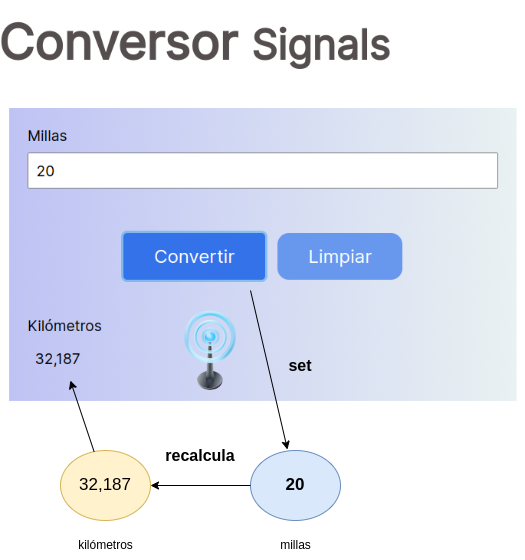

# Ejemplo Conversor - Signals Angular

En este ejemplo se muestra como crear un conversor de millas a kilometros utilizando el framework Angular en su version 16, en la que podemos aplicar los `signals`.

## ZoneJS

Anteriormente a la version 16, siempre se utilizaba `zonejs` para detectar los cambios en los componentes.

Cuando se producía una cambio en la aplicacion era detectado por zonejs y se activaba la deteccion de cambios en los componentes. En ese momento Angular comienza a recorrer todos los componentes del arbol de componentes y comienza a verificar si hay cambios en los estados de los mismos que afectan a la vista, si los hay, se actualizan en la vista.

## Problema

El problema que se presentaba con esta forma de detección de cambios es que se recorrían todos los componentes del árbol de componentes, sin importar si había cambios o no en los mismos. Ésto generaba un consumo de recursos innecesario. Por lo que viene **super signals** a solucionar este problema.


## Signals al rescate

> Los signals permiten la creación de relaciones reactivas entre datos: ésto quiere decir que cuando un valor cambia, los valores que dependen de él también son notificados y se actualizan automáticamente.

Los signals se basan en el concepto de `Producers` y `Consumers`. En el que los producers son los que emiten los cambios y los consumers son los que reciben los cambios sin la necesidad de recorrer todo el arbol en busca de donde se produjo el cambio.

### Creación de un signal

El proceso de crear un signal es muy simple. Solo debemos asignar a una variable el resultado de la funcion `signal` y pasarle como parametro el valor inicial del mismo.

``` typescript
millas = signal(0)
```

### Consumir un signal

La forma de obtener el valor de un signal tambien es muy sencilla, solamente hay que llamar a millas como si fuera un getter.

``` typescript
millas()
```

Por ejemplo, podemos utilizarlo en el HTML de la siguiente forma:

```html
<div class="unidad">millas()</div>
```

Desde aqui vamos a poder manejarlo de la misma manera que haciamos con otros parametros de los componentes. Por ejemplo aplicandoles pipes.

```html
<div class="unidad">{{millas() | number: '1.1-2':locale}}</div>
```

### Emitir un signal (Producers)

Para emitir un signal, debemos hacer un cambio en el valor del mismo. Para esto tenemos 3 opciones diferentes:

### Set

Para setear un valor _x_ en el signal, debemos llamar a la funcion `set` del mismo y pasarle como parametro el nuevo valor.

``` typescript
millas.set(53);
```

### Update

Para actualizar un valor _x_ en el signal, debemos llamar a la funcion `update` del mismo y pasarle como parametro una funcion que recibe como parametro el valor actual del signal y retorna el nuevo valor.

```ts
millas.update((millas) => millas + 1);
```


## Consumir un signal (Consumers)

Ademas del `getter` que se utiliza en los signals para consumirlos. Existen otras dos formas diferentes de consumir un cambio emitido con alguno de los métodos anteriores.

### Computed

La funcion `computed` nos permite crear un signal que depende de otros signals. Es decir, que cuando alguno de los signals que dependen de el cambia, el signal `computed` tambien cambia.

```ts
kilometros = computed(() => millas() * 1.60934)
```

En este caso, cuando cambie el signal de millas, tambien va a cambiar el signal de kilómetros utilizando el getter de millas y aplicandole la formula de conversion.

Podemos hacer cualquier tipo de operación que nos devuelva un valor dentro de la función _computed_. Lo más importante de todo ésto es que podemos utilizar un _computed_ como condicional que solamente vamos a obtener una emisión de su valor cuando esa condición cambie, por ejemplo:

```ts
valido = computed(() => millas() > 0)
```

En este caso estamos haciendo una validación de que el valor de millas sea mayor a 0. Si esto se cumple, el signal `valido` va a emitir un valor `true`, en caso contrario va a emitir un valor `false`. Pero mientras no se cumpla, aunque pasemos por los valores -5, -4, -3, -2 y -1, habiendo cambiado el valor 4 veces, el signal no va a emitir un cambio hasta que el valor de millas sea mayor a 0, recien ahi vamos a obtener un cambio en el signal `valido` y lo vamos a poder consumir. Esto tiene un alto potencial.


## Conclusión

A simple vista el `signal` no cambia nada en la interfaz grafica. Pero hace que la misma sea mucho mas eficiente en la deteccion de cambios, lo que se traduce en un mejor rendimiento de la aplicacion en comparacion con `ZoneJS`.

Anteriormente existia la posibilidad de hacer algo parecido con `BehaviorSubject` de `RxJS`, pero no era tan sencillo de implementar como lo es con los `signals`, ademas de que utiliza observables, lo que nos obliga a ser cuidadosos con las suscripciones y desuscripciones de los mismos.

En este ejemplo se ven todos los casos de uso posibles de signals:




## Ejemplo original

- [Conversor con signals en Angular 16 - por Nico Villamonte - 2023](https://github.com/uqbar-project/eg-conversor-signals-angular)